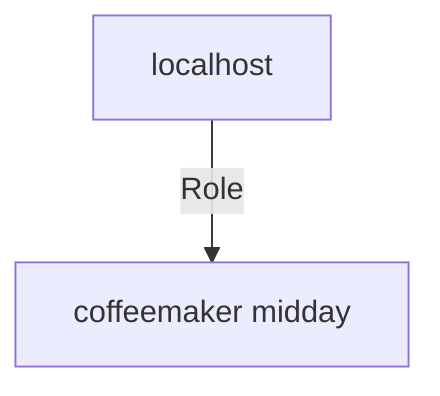

# Generated Documentation
## coffeemaker_midday
Description: Demo coffemaker midday demo


| Field                | Value           |
|--------------------- |-----------------|
| Functional description | Role that make morning coffe |
| Requester            | Service one |
| Users                | ['service one', 'service two'] |
| Date dev             | 19/11/2023 |
| Date prod            | 19/11/2023 |
| Readme update            | 19/11/2023 |
| Version              | 0.0.1 |
| Time Saving              | 10 min |
| Category              | coffee |
| Sub category              | ['morning', 'coffee'] |


### Defaults
**These are static variables with lower priority**
#### File: main.yml
| Var          | Type         | Value       | Required    | Title       |
|--------------|--------------|-------------|-------------|-------------|
| temperature    | str   | 95  | True  | Temperature coffee |
| threshold_adjust_heat    | str   | 90  | True  | None |


### Vars
**These are variables with higher priority**
#### File: main.yml
| Var          | Type         | Value       | Required    | Title       |
|--------------|--------------|-------------|-------------|-------------|
| wait_brewing    | str   | 3  | True  | Wait brewing |
| wait_additional    | str   | 2  | True  | Wait additional time |


### Tasks
| Name | Module | Condition |
| ---- | ------ | --------- |
| Block start coffee maker | block | False |
| Start brewing coffee | ansible.builtin.uri | False |
| Wait for 3 minutes | ansible.builtin.pause | False |
| Check initial coffee temperature | ansible.builtin.uri | False |
| Adjust heat if necessary | ansible.builtin.uri | True |
| Block check coffee maker | block | False |
| Wait for additional 2 minutes | ansible.builtin.pause | False |
| Check final coffee temperature | ansible.builtin.uri | False |
| Notify if coffee is at perfect temperature | ansible.builtin.debug | True |
| Block serve coffee | block | False |
| Prepare for serving | ansible.builtin.uri | False |
| Notify that coffee is ready to serve | ansible.builtin.debug | False |


## Task Flow Graphs

### Graph for main.yml

```mermaid
flowchart TD
  Start
  Start-->|Block Start| Block_start_coffee_maker_block_start_0[block start coffee maker]
  Block_start_coffee_maker_block_start_0-->|Task| Start_brewing_coffee[start brewing coffee]
  Start_brewing_coffee-->|Task| Wait_for_3_minutes[wait for 3 minutes]
  Wait_for_3_minutes-->|Task| Check_initial_coffee_temperature[check initial coffee temperature]
  Check_initial_coffee_temperature-->|Task| Adjust_heat_if_necessary_when_initial_coffee_temp_json_temperature___threshold_adjust_heat[adjust heat if necessary]
  Adjust_heat_if_necessary_when_initial_coffee_temp_json_temperature___threshold_adjust_heat---|When: initial coffee temp json temperature   threshold<br>adjust heat| Adjust_heat_if_necessary_when_initial_coffee_temp_json_temperature___threshold_adjust_heat
  Adjust_heat_if_necessary_when_initial_coffee_temp_json_temperature___threshold_adjust_heat-.->|End of Block| Block_start_coffee_maker_block_start_0
  Adjust_heat_if_necessary_when_initial_coffee_temp_json_temperature___threshold_adjust_heat-->|Rescue Start| Block_start_coffee_maker_rescue_start_0[block start coffee maker]
  Block_start_coffee_maker_rescue_start_0-->|Task| Notify_of_initial_brewing_failure[notify of initial brewing failure]
  Notify_of_initial_brewing_failure-.->|End of Rescue Block| Block_start_coffee_maker_block_start_0
  Notify_of_initial_brewing_failure-->|Block Start| Block_check_coffee_maker_block_start_0[block check coffee maker]
  Block_check_coffee_maker_block_start_0-->|Task| Wait_for_additional_2_minutes[wait for additional 2 minutes]
  Wait_for_additional_2_minutes-->|Task| Check_final_coffee_temperature[check final coffee temperature]
  Check_final_coffee_temperature-->|Task| Notify_if_coffee_is_at_perfect_temperature_when_final_coffee_temp_json_temperature____temperature[notify if coffee is at perfect temperature]
  Notify_if_coffee_is_at_perfect_temperature_when_final_coffee_temp_json_temperature____temperature---|When: final coffee temp json temperature    temperature| Notify_if_coffee_is_at_perfect_temperature_when_final_coffee_temp_json_temperature____temperature
  Notify_if_coffee_is_at_perfect_temperature_when_final_coffee_temp_json_temperature____temperature-.->|End of Block| Block_check_coffee_maker_block_start_0
  Notify_if_coffee_is_at_perfect_temperature_when_final_coffee_temp_json_temperature____temperature-->|Rescue Start| Block_check_coffee_maker_rescue_start_0[block check coffee maker]
  Block_check_coffee_maker_rescue_start_0-->|Task| Notify_of_temperature_issue[notify of temperature issue]
  Notify_of_temperature_issue-.->|End of Rescue Block| Block_check_coffee_maker_block_start_0
  Notify_of_temperature_issue-->|Block Start| Block_serve_coffee_block_start_0[block serve coffee]
  Block_serve_coffee_block_start_0-->|Task| Prepare_for_serving[prepare for serving]
  Prepare_for_serving-->|Task| Notify_that_coffee_is_ready_to_serve[notify that coffee is ready to serve]
  Notify_that_coffee_is_ready_to_serve-.->|End of Block| Block_serve_coffee_block_start_0
```



## Playbook
```yml
---
- name: Demo midday coffee
  hosts: localhost
  connection: local
  roles:
    - coffeemaker_midday

```
## Playbook graph


## Author Information
Lucian BLETAN

#### License
license (GPL-2.0-or-later, MIT, etc)

#### Minimum Ansible Version
2.1

#### Platforms
- **Fedora**: ['all', 25]
- **RedHat**: [7, 8]
