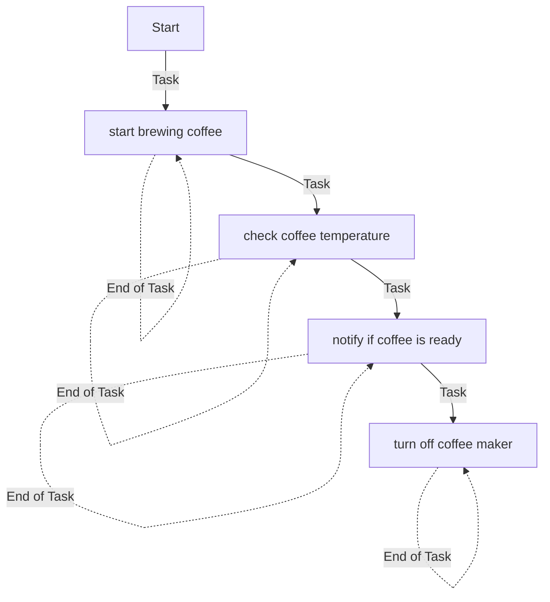
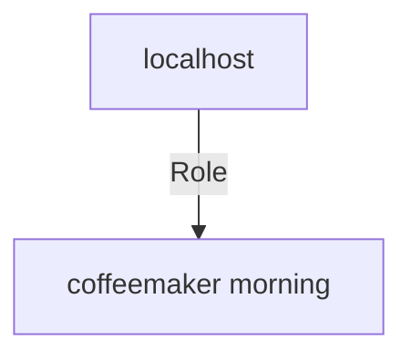

# Generated Documentation
## coffeemaker_morning
Description: Docsible coffemaker morning demo


| Field                | Value           |
|--------------------- |-----------------|
| Functional description | Role that make morning coffe |
| Requester            | Service one |
| Users                | ['service one', 'service two'] |
| Date dev             | 19/11/2023 |
| Date prod            | 19/11/2023 |
| Readme update            | 19/11/2023 |
| Version              | 0.0.1 |
| Time Saving              | 10 min |
| Category              | coffee |
| Sub category              | ['morning', 'coffee'] |


### Defaults
**These are static variables with lower priority**
#### File: main.yml
| Var          | Type         | Value       | Required    | Title       |
|--------------|--------------|-------------|-------------|-------------|
| temperature    | str   | 90  | True  | Temperature coffee |


### Vars

No vars available.


### Tasks
| Name | Module | Condition |
| ---- | ------ | --------- |
| Start brewing coffee | ansible.builtin.uri | False |
| Check coffee temperature | ansible.builtin.uri | False |
| Notify if coffee is ready | ansible.builtin.debug | True |
| Turn off coffee maker | ansible.builtin.uri | True |


## Task Flow Graphs

### Graph for main.yml



## Playbook
```yml
---
- name: Demo morning coffee
  hosts: localhost
  connection: local
  roles:
    - coffeemaker_morning

```
## Playbook graph


## Author Information
Lucian BLETAN

#### License
license (GPL-2.0-or-later, MIT, etc)

#### Minimum Ansible Version
2.1

#### Platforms
No platforms specified.