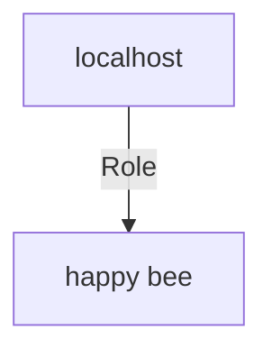

<!-- DOCSIBLE START -->

# 📃 Role overview

## happy-bee

```
Role belongs to lucian/devops
Namespace - lucian
Collection - devops
Version - 1.0.0
Repository - http://example.com/repository
```

Description: your role description


| Field                | Value           |
|--------------------- |-----------------|
| Readme update        | 03/07/2024 |


<details>
<summary><b>🧩 Argument Specifications in meta/argument_specs</b></summary>

#### Key: main 
**Description**: EXPECTED FAILURE Validate the argument spec for the 'test1' role


  - **test1_choices**
    - **Required**: False
    - **Type**: str
    - **Default**: this paddle game
    - **Description**: No description provided
  
      - **Choices**: 
    
          - this paddle game
    
          - the astray
    
          - this remote control
    
          - the chair
    
  
  
  

  - **tidy_expected**
    - **Required**: false
    - **Type**: list
    - **Default**: none
    - **Description**: No description provided
  
  
  

  - **test1_var1**
    - **Required**: false
    - **Type**: str
    - **Default**: THIS IS THE DEFAULT SURVEY ANSWER FOR test1_survey_test1_var1
    - **Description**: No description provided
  
  
  

  - **test1_var2**
    - **Required**: False
    - **Type**: str
    - **Default**: This IS THE DEFAULT fake band name / test1_var2 answer from survey_spec.yml
    - **Description**: No description provided
  
  
  

  - **bust_some_stuff**
    - **Required**: false
    - **Type**: int
    - **Default**: none
    - **Description**: No description provided
  
  
  

  - **some_choices**
    - **Required**: False
    - **Type**: str
    - **Default**: none
    - **Description**: No description provided
  
      - **Choices**: 
    
          - choice1
    
          - choice2
    
  
  
  

  - **some_str**
    - **Required**: false
    - **Type**: str
    - **Default**: none
    - **Description**: No description provided
  
  
  

  - **some_list**
    - **Required**: false
    - **Type**: list
    - **Default**: none
    - **Description**: No description provided
  
  
  

  - **some_dict**
    - **Required**: false
    - **Type**: dict
    - **Default**: none
    - **Description**: No description provided
  
  
  

  - **some_bool**
    - **Required**: false
    - **Type**: bool
    - **Default**: none
    - **Description**: No description provided
  
  
  

  - **some_int**
    - **Required**: false
    - **Type**: int
    - **Default**: none
    - **Description**: No description provided
  
  
  

  - **some_float**
    - **Required**: false
    - **Type**: float
    - **Default**: none
    - **Description**: No description provided
  
  
  

  - **some_path**
    - **Required**: false
    - **Type**: path
    - **Default**: none
    - **Description**: No description provided
  
  
  

  - **some_raw**
    - **Required**: false
    - **Type**: raw
    - **Default**: none
    - **Description**: No description provided
  
  
  

  - **some_jsonarg**
    - **Required**: True
    - **Type**: jsonarg
    - **Default**: none
    - **Description**: No description provided
  
  
  

  - **some_json**
    - **Required**: True
    - **Type**: json
    - **Default**: none
    - **Description**: No description provided
  
  
  

  - **some_bytes**
    - **Required**: false
    - **Type**: bytes
    - **Default**: none
    - **Description**: No description provided
  
  
  

  - **some_bits**
    - **Required**: false
    - **Type**: bits
    - **Default**: none
    - **Description**: No description provided
  
  
  

  - **some_str_aliases**
    - **Required**: false
    - **Type**: str
    - **Default**: none
    - **Description**: No description provided
  
  
      - **Aliases**: 
    
          - some_str_nicknames
    
          - some_str_akas
    
          - some_str_formerly_known_as
    
  
  

  - **some_dict_options**
    - **Required**: false
    - **Type**: dict
    - **Default**: none
    - **Description**: No description provided
  
  
  
    

    - **some_second_level**
      - **Required**: false
      - **Type**: bool
      - **Default**: True
      - **Description**: No description provided
  
  
  


  

  - **some_more_dict_options**
    - **Required**: false
    - **Type**: dict
    - **Default**: none
    - **Description**: No description provided
  
  
  
    

    - **some_second_level**
      - **Required**: false
      - **Type**: str
      - **Default**: none
      - **Description**: No description provided
  
  
  


  

  - **some_str_removed_in**
    - **Required**: false
    - **Type**: str
    - **Default**: none
    - **Description**: No description provided
  
  
  

  - **some_tmp_path**
    - **Required**: false
    - **Type**: path
    - **Default**: none
    - **Description**: No description provided
  
  
  

  - **multi_level_option**
    - **Required**: false
    - **Type**: dict
    - **Default**: none
    - **Description**: No description provided
  
  
  
    

    - **second_level**
      - **Required**: false
      - **Type**: dict
      - **Default**: none
      - **Description**: No description provided
  
  
  
    

      - **third_level**
        - **Required**: True
        - **Type**: int
        - **Default**: none
        - **Description**: No description provided
  
  
  


  


  


#### Key: other 
**Description**: A simpler set of required args for other tasks


  - **test1_var1**
    - **Required**: false
    - **Type**: str
    - **Default**: This the default value for the other set of arg specs for  test1 test1_var1
    - **Description**: No description provided
  
  
  


#### Key: test1_other 
**Description**: test1_other for role_that_includes_role


  - **some_test1_other_arg**
    - **Required**: false
    - **Type**: str
    - **Default**: The some_test1_other_arg default value
    - **Description**: No description provided
  
  
  

  - **some_required_str**
    - **Required**: True
    - **Type**: str
    - **Default**: none
    - **Description**: No description provided
  
  
  


</details>


### Defaults

**These are static variables with lower priority**

#### File: defaults/main.yml

| Var          | Type         | Value       |Required    | Title       |
|--------------|--------------|-------------|-------------|-------------|
| [min_pollen_count](defaults/main.yml#L6)   | int   | `300`  |  True  |  Minimum pollen count required to consider pollination |
| [optimal_temperature_range](defaults/main.yml#L10)   | dict   | `{'min': 18, 'max': 30}`  |  True  |  Optimal temperature range for pollination (in °C) |
| [max_wind_speed](defaults/main.yml#L15)   | int   | `20`  |  True  |  Wind speed threshold above which pollination is not advisable (in km/h) |
| [ideal_humidity](defaults/main.yml#L23)   | int   | `55`  |  True  |  Humidity level considered ideal for pollination (percentage) |
| [my_var](defaults/main.yml#L26)   | str   | `<multiline value>`  |  n/a  |  n/a |
| [hashicorp_consul_configuration_string](defaults/main.yml#L32)   | str   | `<multiline value>`  |  n/a  |  n/a |
| [fruits](defaults/main.yml#L41)   | str   | `<list too long>`  |  n/a  |  n/a |
<details>
<summary><b>🖇️ Full descriptions for vars in defaults/main.yml</b></summary>
<br>
<b>max_wind_speed:</b> description1 des
<br>
<b>ideal_humidity:</b> This is the first line of the description.<br>
This is the second line of the description.<br>
This is the third line of the description.<br>
<br>
<br>
</details>


### Vars

**These are variables with higher priority**
#### File: vars/main.yml

| Var          | Type         | Value       |Required    | Title       |
|--------------|--------------|-------------|-------------|-------------|
| [min_pollen_count](vars/main.yml#L7)    | int   | `300`  | True | Minimum pollen count required to consider pollination |
| [optimal_temperature_range](vars/main.yml#L11)    | dict   | `{'min': 18, 'max': 30}`  | True | Optimal temperature range for pollination (in °C) |
| [max_wind_speed](vars/main.yml#L15)    | int   | `20`  | True | Wind speed threshold above which pollination is not advisable (in km/h) |
| [ideal_humidity](vars/main.yml#L19)    | int   | `55`  | True | Humidity level considered ideal for pollination (percentage) |
| [hashicorp_consul_user](vars/main.yml#L23)    | str   | `consul`  | n/a | n/a |
| [hashicorp_consul_group](vars/main.yml#L24)    | str   | `consul`  | n/a | n/a |
| [hashicorp_consul_binary_path](vars/main.yml#L25)    | str   | `/usr/local/bin/consul`  | n/a | n/a |
| [hashicorp_consul_envoy_binary_path](vars/main.yml#L26)    | str   | `/usr/local/bin/envoy`  | n/a | n/a |
| [hashicorp_consul_deb_architecture_map](vars/main.yml#L27)    | dict   | `{'x86_64': 'amd64', 'aarch64': 'arm64', 'armv7l': 'arm', 'armv6l': 'arm'}`  | n/a | n/a |
| [hashicorp_consul_envoy_architecture_map](vars/main.yml#L32)    | dict   | `{'x86_64': 'x86_64', 'aarch64': 'aarch64'}`  | n/a | n/a |
| [hashicorp_consul_architecture](vars/main.yml#L35)    | str   | `{{ hashicorp_consul_deb_architecture_map[ansible_architecture] \| default(ansible_architecture) }}`  | n/a | n/a |
| [hashicorp_consul_envoy_architecture](vars/main.yml#L36)    | str   | `{{ hashicorp_consul_envoy_architecture_map[ansible_architecture] \| default(ansible_architecture) }}`  | n/a | n/a |
| [hashicorp_consul_service_name](vars/main.yml#L37)    | str   | `consul`  | n/a | n/a |
| [hashicorp_consul_github_api](vars/main.yml#L38)    | str   | `https://api.github.com/repos`  | n/a | n/a |
| [hashicorp_consul_envoy_github_project](vars/main.yml#L39)    | str   | `envoyproxy/envoy`  | n/a | n/a |
| [hashicorp_consul_github_project](vars/main.yml#L40)    | str   | `hashicorp/consul`  | n/a | n/a |
| [hashicorp_consul_github_url](vars/main.yml#L41)    | str   | `https://github.com`  | n/a | n/a |
| [hashicorp_consul_repository_url](vars/main.yml#L42)    | str   | `https://releases.hashicorp.com/consul`  | n/a | n/a |
| [hashicorp_consul_configuration](vars/main.yml#L44)    | dict   | `{'domain': '{{ hashicorp_consul_domain }}', 'datacenter': '{{ hashicorp_consul_datacenter }}', 'primary_datacenter': '{{ hashicorp_consul_primary_datacenter }}', 'data_dir': '{{ hashicorp_consul_data_dir }}', 'encrypt': '{{ hashicorp_consul_gossip_encryption_key }}', 'server': '{{ hashicorp_consul_enable_server }}', 'ui_config': '{{ hashicorp_consul_ui_configuration }}', 'connect': '{{ hashicorp_consul_mesh_configuration }}', 'leave_on_terminate': '{{ hashicorp_consul_leave_on_terminate }}', 'rejoin_after_leave': '{{ hashicorp_consul_rejoin_after_leave }}', 'enable_script_checks': '{{ hashicorp_consul_enable_script_checks }}', 'enable_syslog': True, 'acl': '{{ hashicorp_consul_acl_configuration }}', 'dns_config': '{{ hashicorp_consul_dns_configuration }}', 'log_level': '{{ hashicorp_consul_log_level }}', 'ports': {'dns': 8600, 'server': 8300, 'serf_lan': 8301, 'serf_wan': 8302, 'sidecar_min_port': 21000, 'sidecar_max_port': 21255, 'expose_min_port': 21500, 'expose_max_port': 21755}}`  | n/a | n/a |
| [hashicorp_consul_configuration_string](vars/main.yml#L70)    | str   | `<multiline value>`  | n/a | n/a |
| [hashicorp_consul_server_configuration_string](vars/main.yml#L77)    | str   | `<multiline value>`  | n/a | n/a |


### Tasks


#### File: tasks/main.yml

| Name | Module | Has Conditions | Comments |
| ---- | ------ | --------- |  -------- |
| Initialize environmental monitoring | ansible.builtin.debug | False | tasks file for happy-bee comment for task |
| Environmental impact assessment | block | False |  |
| Assess local flora health | ansible.builtin.set_fact | False | Name simulated static value for demonstration |
| Evaluate impact of pollination on local flora | ansible.builtin.debug | False |  |
| Resource replenishment and ecological support | block | False |  |
| Calculate needed resources for next pollination cycle | ansible.builtin.set_fact | False |  |
| Plan resource gathering missions | ansible.builtin.debug | True |  |
| Integration with external ecological monitoring systems | block | False |  |
| Fetch data from external sensors | ansible.builtin.set_fact | False |  |
| Analyze external environmental data | ansible.builtin.debug | False |  |
| Long-term strategy adjustments and machine learning feedback | block | False |  |
| Adjust pollination strategies based on historical data | ansible.builtin.debug | False |  |
| Feed operational data back into machine learning models | ansible.builtin.debug | True |  |
| Preparation for adverse weather conditions | block | False |  |
| Monitor weather forecasts | ansible.builtin.set_fact | False |  |
| Implement contingency plans for adverse weather | ansible.builtin.debug | False |  |
| End of cycle review and diagnostics | block | False |  |
| Perform system diagnostics | ansible.builtin.debug | False |  |
| Review operational effectiveness | ansible.builtin.debug | False |  |
| Schedule maintenance and updates | ansible.builtin.debug | False |  |
| Initialize pollination operations | ansible.builtin.debug | False |  |
| Check environmental conditions for pollination | block | False |  |
| Simulate fetching current weather data | ansible.builtin.set_fact | False |  |
| Evaluate suitability for pollination based on temperature | ansible.builtin.debug | True |  |
| Alert on unsuitable wind conditions for pollination | ansible.builtin.debug | True |  |
| Check humidity levels for pollination | ansible.builtin.debug | True |  |
| Pollen detection and pollination decision-making | block | False |  |
| Simulate pollen detection | ansible.builtin.set_fact | False |  |
| Decide on pollination based on detected pollen | ansible.builtin.debug | True |  |
| Alert if insufficient pollen for pollination | ansible.builtin.debug | True |  |
| Complete pollination operations | ansible.builtin.debug | False |  |


## Task Flow Graphs


### Graph for main.yml

```mermaid
flowchart TD
Start
classDef block stroke:#3498db,stroke-width:2px;
classDef task stroke:#4b76bb,stroke-width:2px;
classDef include stroke:#2ecc71,stroke-width:2px;
classDef import stroke:#f39c12,stroke-width:2px;
classDef rescue stroke:#665352,stroke-width:2px;
classDef importPlaybook stroke:#9b59b6,stroke-width:2px;
classDef importTasks stroke:#34495e,stroke-width:2px;
classDef includeTasks stroke:#16a085,stroke-width:2px;
classDef importRole stroke:#699ba7,stroke-width:2px;
classDef includeRole stroke:#2980b9,stroke-width:2px;
classDef includeVars stroke:#8e44ad,stroke-width:2px;

  Start-->|Task| Initialize_environmental_monitoring0[initialize environmental monitoring]:::task
  Initialize_environmental_monitoring0-->|Block Start| Environmental_impact_assessment1_block_start_0[[environmental impact assessment]]:::block
  Environmental_impact_assessment1_block_start_0-->|Task| Assess_local_flora_health0[assess local flora health]:::task
  Assess_local_flora_health0-->|Task| Evaluate_impact_of_pollination_on_local_flora1[evaluate impact of pollination on local flora]:::task
  Evaluate_impact_of_pollination_on_local_flora1-.->|End of Block| Environmental_impact_assessment1_block_start_0
  Evaluate_impact_of_pollination_on_local_flora1-->|Rescue Start| Environmental_impact_assessment1_rescue_start_0[environmental impact assessment]:::rescue
  Environmental_impact_assessment1_rescue_start_0-->|Task| Handle_data_collection_failure_on_flora_health0[handle data collection failure on flora health]:::task
  Handle_data_collection_failure_on_flora_health0-.->|End of Rescue Block| Environmental_impact_assessment1_block_start_0
  Handle_data_collection_failure_on_flora_health0-->|Block Start| Resource_replenishment_and_ecological_support2_block_start_0[[resource replenishment and ecological support]]:::block
  Resource_replenishment_and_ecological_support2_block_start_0-->|Task| Calculate_needed_resources_for_next_pollination_cycle0[calculate needed resources for next pollination<br>cycle]:::task
  Calculate_needed_resources_for_next_pollination_cycle0-->|Task| Plan_resource_gathering_missions1_when_resources_needed[plan resource gathering missions]:::task
  Plan_resource_gathering_missions1_when_resources_needed---|When: resources needed| Plan_resource_gathering_missions1_when_resources_needed
  Plan_resource_gathering_missions1_when_resources_needed-.->|End of Block| Resource_replenishment_and_ecological_support2_block_start_0
  Plan_resource_gathering_missions1_when_resources_needed-->|Block Start| Integration_with_external_ecological_monitoring_systems3_block_start_0[[integration with external ecological monitoring<br>systems]]:::block
  Integration_with_external_ecological_monitoring_systems3_block_start_0-->|Task| Fetch_data_from_external_sensors0[fetch data from external sensors]:::task
  Fetch_data_from_external_sensors0-->|Task| Analyze_external_environmental_data1[analyze external environmental data]:::task
  Analyze_external_environmental_data1-.->|End of Block| Integration_with_external_ecological_monitoring_systems3_block_start_0
  Analyze_external_environmental_data1-->|Block Start| Long_term_strategy_adjustments_and_machine_learning_feedback4_block_start_0[[long term strategy adjustments and machine<br>learning feedback]]:::block
  Long_term_strategy_adjustments_and_machine_learning_feedback4_block_start_0-->|Task| Adjust_pollination_strategies_based_on_historical_data0[adjust pollination strategies based on historical<br>data]:::task
  Adjust_pollination_strategies_based_on_historical_data0-->|Task| Feed_operational_data_back_into_machine_learning_models1_when_historical_data_available___default_false_[feed operational data back into machine learning<br>models]:::task
  Feed_operational_data_back_into_machine_learning_models1_when_historical_data_available___default_false_---|When: historical data available   default false | Feed_operational_data_back_into_machine_learning_models1_when_historical_data_available___default_false_
  Feed_operational_data_back_into_machine_learning_models1_when_historical_data_available___default_false_-.->|End of Block| Long_term_strategy_adjustments_and_machine_learning_feedback4_block_start_0
  Feed_operational_data_back_into_machine_learning_models1_when_historical_data_available___default_false_-->|Block Start| Preparation_for_adverse_weather_conditions5_block_start_0[[preparation for adverse weather conditions]]:::block
  Preparation_for_adverse_weather_conditions5_block_start_0-->|Task| Monitor_weather_forecasts0[monitor weather forecasts]:::task
  Monitor_weather_forecasts0-->|Task| Implement_contingency_plans_for_adverse_weather1[implement contingency plans for adverse weather]:::task
  Implement_contingency_plans_for_adverse_weather1-.->|End of Block| Preparation_for_adverse_weather_conditions5_block_start_0
  Implement_contingency_plans_for_adverse_weather1-->|Block Start| End_of_cycle_review_and_diagnostics6_block_start_0[[end of cycle review and diagnostics]]:::block
  End_of_cycle_review_and_diagnostics6_block_start_0-->|Task| Perform_system_diagnostics0[perform system diagnostics]:::task
  Perform_system_diagnostics0-->|Task| Review_operational_effectiveness1[review operational effectiveness]:::task
  Review_operational_effectiveness1-.->|End of Block| End_of_cycle_review_and_diagnostics6_block_start_0
  Review_operational_effectiveness1-->|Task| Schedule_maintenance_and_updates7[schedule maintenance and updates]:::task
  Schedule_maintenance_and_updates7-->|Task| Initialize_pollination_operations8[initialize pollination operations]:::task
  Initialize_pollination_operations8-->|Block Start| Check_environmental_conditions_for_pollination9_block_start_0[[check environmental conditions for pollination]]:::block
  Check_environmental_conditions_for_pollination9_block_start_0-->|Task| Simulate_fetching_current_weather_data0[simulate fetching current weather data]:::task
  Simulate_fetching_current_weather_data0-->|Task| Evaluate_suitability_for_pollination_based_on_temperature1_when__current_temperature___int____optimal_temperature_range_min__and__current_temperature___int____optimal_temperature_range_max_[evaluate suitability for pollination based on<br>temperature]:::task
  Evaluate_suitability_for_pollination_based_on_temperature1_when__current_temperature___int____optimal_temperature_range_min__and__current_temperature___int____optimal_temperature_range_max_---|When:  current temperature   int    optimal temperature<br>range min  and  current temperature   int   <br>optimal temperature range max | Evaluate_suitability_for_pollination_based_on_temperature1_when__current_temperature___int____optimal_temperature_range_min__and__current_temperature___int____optimal_temperature_range_max_
  Evaluate_suitability_for_pollination_based_on_temperature1_when__current_temperature___int____optimal_temperature_range_min__and__current_temperature___int____optimal_temperature_range_max_-->|Task| Alert_on_unsuitable_wind_conditions_for_pollination2_when_current_wind_speed___int___max_wind_speed[alert on unsuitable wind conditions for<br>pollination]:::task
  Alert_on_unsuitable_wind_conditions_for_pollination2_when_current_wind_speed___int___max_wind_speed---|When: current wind speed   int   max wind speed| Alert_on_unsuitable_wind_conditions_for_pollination2_when_current_wind_speed___int___max_wind_speed
  Alert_on_unsuitable_wind_conditions_for_pollination2_when_current_wind_speed___int___max_wind_speed-->|Task| Check_humidity_levels_for_pollination3_when_current_humidity___int____ideal_humidity[check humidity levels for pollination]:::task
  Check_humidity_levels_for_pollination3_when_current_humidity___int____ideal_humidity---|When: current humidity   int    ideal humidity| Check_humidity_levels_for_pollination3_when_current_humidity___int____ideal_humidity
  Check_humidity_levels_for_pollination3_when_current_humidity___int____ideal_humidity-.->|End of Block| Check_environmental_conditions_for_pollination9_block_start_0
  Check_humidity_levels_for_pollination3_when_current_humidity___int____ideal_humidity-->|Rescue Start| Check_environmental_conditions_for_pollination9_rescue_start_0[check environmental conditions for pollination]:::rescue
  Check_environmental_conditions_for_pollination9_rescue_start_0-->|Task| Handle_failure_in_fetching_weather_data0[handle failure in fetching weather data]:::task
  Handle_failure_in_fetching_weather_data0-.->|End of Rescue Block| Check_environmental_conditions_for_pollination9_block_start_0
  Handle_failure_in_fetching_weather_data0-->|Block Start| Pollen_detection_and_pollination_decision_making10_block_start_0[[pollen detection and pollination decision making]]:::block
  Pollen_detection_and_pollination_decision_making10_block_start_0-->|Task| Simulate_pollen_detection0[simulate pollen detection]:::task
  Simulate_pollen_detection0-->|Task| Decide_on_pollination_based_on_detected_pollen1_when_detected_pollen_count___int____min_pollen_count[decide on pollination based on detected pollen]:::task
  Decide_on_pollination_based_on_detected_pollen1_when_detected_pollen_count___int____min_pollen_count---|When: detected pollen count   int    min pollen count| Decide_on_pollination_based_on_detected_pollen1_when_detected_pollen_count___int____min_pollen_count
  Decide_on_pollination_based_on_detected_pollen1_when_detected_pollen_count___int____min_pollen_count-->|Task| Alert_if_insufficient_pollen_for_pollination2_when_detected_pollen_count___int___min_pollen_count[alert if insufficient pollen for pollination]:::task
  Alert_if_insufficient_pollen_for_pollination2_when_detected_pollen_count___int___min_pollen_count---|When: detected pollen count   int   min pollen count| Alert_if_insufficient_pollen_for_pollination2_when_detected_pollen_count___int___min_pollen_count
  Alert_if_insufficient_pollen_for_pollination2_when_detected_pollen_count___int___min_pollen_count-.->|End of Block| Pollen_detection_and_pollination_decision_making10_block_start_0
  Alert_if_insufficient_pollen_for_pollination2_when_detected_pollen_count___int___min_pollen_count-->|Rescue Start| Pollen_detection_and_pollination_decision_making10_rescue_start_0[pollen detection and pollination decision making]:::rescue
  Pollen_detection_and_pollination_decision_making10_rescue_start_0-->|Task| Handle_failure_in_pollen_detection0[handle failure in pollen detection]:::task
  Handle_failure_in_pollen_detection0-.->|End of Rescue Block| Pollen_detection_and_pollination_decision_making10_block_start_0
  Handle_failure_in_pollen_detection0-->|Task| Complete_pollination_operations11[complete pollination operations]:::task
  Complete_pollination_operations11-->End
```




## Playbook

```yml
---
- hosts: localhost
  connection: local
  roles:
    - role: ../happy-bee

```
## Playbook graph


## Author Information
Lucian BLETAN

#### License

license (GPL-2.0-or-later, MIT, etc)

#### Minimum Ansible Version

2.1

#### Platforms

- **Fedora**: ['all', 25]

<!-- DOCSIBLE END -->